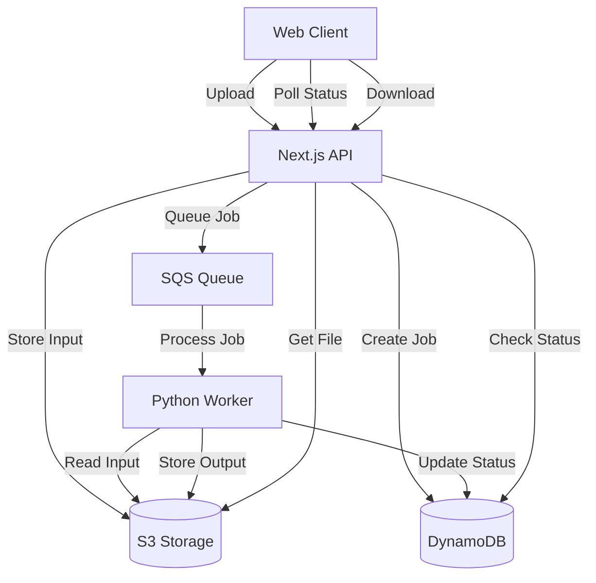

# System Architecture

Calmobi is a cloud-native web service  which transforms unstructured calendar data into standardized ICS files through a distributed cloud architecture. This design leverages serverless processing to maintain high availability while minimizing operational costs.

## Core Architecture

At its heart, the system operates as a distributed processor with a simple web interface. Users interact with a Next.js frontend that handles file uploads and manages the conversion workflow. Rather than processing files synchronously, the system employs an asynchronous approach that separates the upload, processing, and delivery phases.

The Next.js API layer serves as the system's coordinator. When users submit content, the API immediately stores it in S3 with a 24-hour retention policy. This approach prevents data loss and enables retry capabilities without maintaining persistent storage. The API then creates a job record in DynamoDB and queues the processing request in SQS, allowing for immediate user feedback while the conversion runs asynchronously.

Python workers, running in AWS Fargate, form the processing backbone of the system. These workers operate independently, pulling jobs from SQS as capacity allows. This design enables automatic scaling - when the queue grows, additional workers spin up to handle the load. Once processing completes, workers store the resulting ICS files in S3 and update the job status in DynamoDB.

## Processing Flow

The conversion workflow begins when a user submits calendar data. The system immediately returns a job identifier, allowing users to track their conversion's progress. Behind the scenes, the Next.js API coordinates the workflow, storing input data and queuing the conversion job.

Workers continuously monitor the SQS queue for new jobs. Upon picking up a job, a worker retrieves the input from S3, processes it using our Python conversion logic, and generates an ICS file. The worker then stores this file in S3 and updates the job status in DynamoDB. Throughout this process, the client polls the API for status updates, creating a responsive user experience without requiring long-running connections.

When processing completes, the system generates a temporary S3 download link, valid for a short duration. This approach ensures secure file delivery while maintaining system security. Failed conversions trigger automatic retries, with the SQS queue handling retry logic and dead-letter processing for persistent failures.

## Scaling and Cost Management

The architecture's serverless nature provides inherent scalability. Fargate workers scale based on queue depth, spinning up new containers as demand increases and shutting down during idle periods. This design eliminates idle costs while maintaining the ability to handle sudden traffic spikes.

Cost control is built into the design. With per-request pricing for API calls, per-task pricing for Fargate, and minimal storage requirements, the system typically costs fractions of a cent per conversion. A typical conversion costs approximately $0.0002, making the system economically viable at both low and moderate volumes.

## Future Considerations

The system's modular design allows for future enhancements without architectural changes. The worker implementation can be extended to support additional calendar formats, while the API layer can be enhanced to support batch processing or template-based conversions. The existing separation of concerns ensures that such modifications can be made without disrupting the core conversion workflow.

Analytics and monitoring can be added through CloudWatch metrics and logs, providing insight into system performance and usage patterns. The existing DynamoDB structure supports adding metadata and tracking fields without schema changes, enabling gradual feature expansion based on user needs.

This architecture provides a robust foundation for calendar conversion while maintaining the flexibility to evolve with user requirements. Its cloud-native design ensures reliability and scalability while keeping operational complexity and costs to a minimum.
